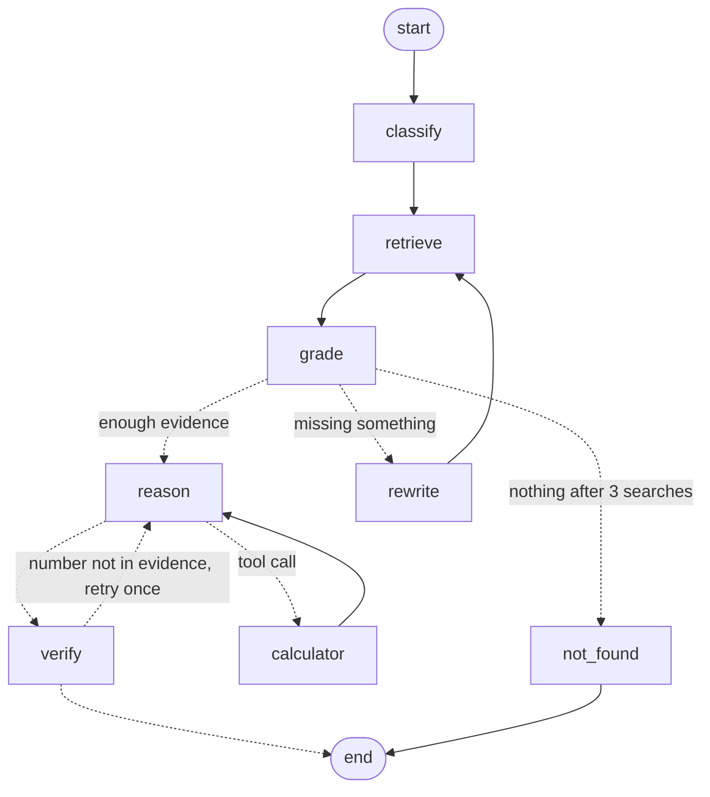

# Financial Report Analyst Agent

Ask questions about real company filings (10-Ks, 10-Qs, earnings releases) and get answers with the
numbers worked out and the source pages cited.

**Live demo: [finreport-agent.streamlit.app](https://finreport-agent.streamlit.app/)**

> "What was 3M's capital expenditure in FY2018?" → **$1,577 million**, cash flow statement, p. 60

Built with **LangGraph** (agent control flow) and **LangChain** (PDF loading, splitting, embeddings,
Chroma, retrievers, tool calling), and evaluated on **[FinanceBench](https://huggingface.co/datasets/PatronusAI/financebench)**,
a benchmark of 150 analyst questions over 84 public filings, each with a reference answer and evidence page.
Runs at zero cost: free-tier hosted LLMs (Groq, Gemini) or a 4B model on a laptop GPU through Ollama,
local embeddings, Chroma on disk.

**Result** (145 held-out FinanceBench questions): on questions that need calculation, the agent answers
**70% correctly vs 50% for plain RAG** with `gpt-oss-120b` and **66% vs 36%** with a 4B model on a 4 GB
laptop GPU (both statistically significant). Overall it improves the 4B model from 46% to 62%
(significant) and `gpt-oss-120b` from 59% to 63% (not significant: it loses ground on qualitative
questions). [Details below](#results).

## How the agent works



| Step | What it does |
|---|---|
| **classify** | Labels the question *lookup / calculate / compare* and writes one search query per figure needed, in 10-K wording ("purchases of property, plant and equipment", not "capex"). |
| **retrieve** | Hybrid search inside the chosen report: dense (`bge-small-en-v1.5` in Chroma) + BM25, fused with reciprocal rank fusion. BM25 catches exact line-item names that embeddings miss. |
| **grade** | The LLM marks which passages are relevant and whether they cover *every* figure needed. |
| **rewrite** | If something is missing, new queries target exactly that, with different terminology. Up to 3 search rounds. |
| **reason ⇄ calculator** | The model gets the *full pages* behind the kept chunks (so a table split across two chunks is never cut in half, capped at ~4k tokens) and answers from them and must send all arithmetic to a safe Python calculator (AST-based, no `eval`). It finishes by calling `submit_answer(answer, pages)`. |
| **verify** | Deterministic check first: every number in the answer must appear in the evidence or a calculator result (allowing rounding and million/billion changes). Only if that fails does an LLM check run; an unsupported answer gets one retry, then becomes a refusal. |
| **not_found** | Answers "I couldn't find this in the report." rather than guessing. |

PDF text is extracted with PyMuPDF in layout mode, so table rows stay on one line
(`Purchases of PP&E | (1,577) | (1,373) | (1,420)`). Every chunk keeps its page number.

## Evaluation

`scripts/run_eval.py` runs three variants on the same questions with the same retriever and model:

- **baseline**: plain RAG (one search with the raw question, one LLM call)
- **agent**: the full graph
- **agent_nocalc**: the graph without the calculator tool (ablation)

It was run with two model setups:

| Setup | Answers | Plans, grades, rewrites, verifies |
|---|---|---|
| Hosted (Groq free tier) | `openai/gpt-oss-120b` | `openai/gpt-oss-20b` |
| Local (Ollama, RTX 3050 laptop GPU, 4 GB) | `qwen3.5:4b` (Q4_K_M) | `qwen3.5:4b` |

Both are graded by the same judge, `qwen/qwen3.8-27b` on Groq. It comes from a different model family
from the answering models, so no model grades its own work. The judge labels each answer
*correct / incorrect / refusal* against FinanceBench's reference answer.

Five questions were used while debugging and tuning prompts (`DEV_IDS` in `scripts/run_eval.py`);
they are excluded from `--sample`, so the reported numbers come from questions the prompts were
not tuned on. `--sample N` draws a sample stratified across FinanceBench's three question types; the results below use all 145. `scripts/report.py` writes [results/RESULTS.md](results/RESULTS.md) with accuracy,
wrong-answer rate, refusal rate, how often the cited and retrieved pages include the gold evidence page,
LLM calls and latency per question, a breakdown by question type, and the calculator ablation
(questions fixed and broken by the tool).

### Results

All 145 held-out questions (every FinanceBench question except the 5 used for debugging; 84 filings).
Significance is an exact McNemar test on the questions where the two versions disagree.

| | Plain RAG | Agent, no calculator | **Agent** |
|---|---|---|---|
| **gpt-oss-120b**: correct | 58.6% | – | **63.4%** |
| wrong / refused | 16.6% / 24.8% | – | 25.5% / 11.0% |
| cites a gold evidence page | 56.6% | – | 64.1% |
| LLM calls · tokens · seconds per question | 1 · 3.2k · 21 | – | 5.0 · 10.5k · 47 |
| **qwen3.5 4B (local GPU)**: correct | 46.2% | 57.9% | **62.1%** |
| wrong / refused | 24.8% / 29.0% | 26.9% / 15.2% | 24.1% / 13.8% |
| cites a gold evidence page | 61.4% | 62.1% | 62.8% |
| LLM calls · tokens · seconds per question | 1 · 3.6k · 13 | 4.0 · 10.9k · 37 | 5.0 · 14.0k · 29 |

Agent vs plain RAG, split by what the question needs:

| | gpt-oss-120b | wins / losses | p | qwen3.5 4B | wins / losses | p |
|---|---|---|---|---|---|---|
| **Numerical reasoning** (64 questions) | 50.0% → **70.3%** | 17 / 4 | **0.007** | 35.9% → **65.6%** | 22 / 3 | **0.0002** |
| Other questions (81) | 65.4% → 58.0% | 7 / 13 | 0.26 | 54.3% → 59.3% | 11 / 7 | 0.48 |
| All 145 | 58.6% → 63.4% | 24 / 17 | 0.35 | 46.2% → 62.1% | 33 / 10 | **0.0006** |

What this shows:

- **The agent is significantly better on questions that need calculation, with both models**
  (+20 points with gpt-oss-120b, +30 with the 4B model). Grading, query rewriting, the calculator and
  the number check pay off where the answer is a figure that has to be found and worked out.
- **It helps a small model much more than a large one.** Overall, the 4B model goes from 46% to 62%
  (significant); gpt-oss-120b from 59% to 63% (not significant).
- **On qualitative questions the large model does better without the agent loop** (65% vs 58%, not
  significant). Reading the 13 losses: the evidence checks refuse answers that are an *absence*
  ("Ulta made no acquisitions", "no debt securities are listed") because there is no passage proving
  a negative, refuse narrative questions (legal cases, what drove inventory up), and a few yes/no
  conclusions go wrong. The agent turns refusals into answers (refusals 25% → 11%), but for the 120B
  model part of that comes back as wrong answers (17% → 26%).
- **The calculator ablation** (4B, 145 questions): 62.1% with it vs 57.9% without; 21 questions
  fixed, 15 broken (p = 0.41, within noise). For gpt-oss-120b it was run on the first 30 questions
  only (63.3% vs 60.0%).
- **Cost:** about 3-4x the tokens and 2x the time of plain RAG.
- One gpt-oss-120b agent run failed on every retry (the model kept returning invalid JSON); it is
  counted as wrong.

The obvious next step is routing: send numerical questions through the agent and qualitative ones
through a lighter path. That has to be tuned on separate questions to be a fair claim, since all 145
here are used for the evaluation.

The first 30-question run (the starting point of this sample) looked better for the agent with
gpt-oss-120b (+17 points) because plain RAG happened to do badly on those 30 (47% vs 62% on the other
115), which is why the full set was run before drawing conclusions.

Full tables by question type: [results/RESULTS.md](results/RESULTS.md) (gpt-oss-120b) and
[results/RESULTS_ollama.md](results/RESULTS_ollama.md) (4B). Every answer, citation, agent trace and
judge's reason is in `results/*.jsonl`, and the app's *Evaluation results* tab lets you browse them.

## Run it

```bash
pip install -r requirements.txt
cp .env.example .env                  # add a free Groq and/or Gemini key

python scripts/download_pdfs.py       # 84 filings, ~160 MB
python scripts/build_index.py         # embeds on CPU, ~2-3 h for all; or --docs 3M_2018_10K
streamlit run app.py                  # choose Groq, Gemini or a local Ollama model in the sidebar

python -m pytest                      # 33 offline tests (scripted LLM, no API calls)
python scripts/run_eval.py --variants baseline agent agent_nocalc --sample 30
python scripts/report.py
```

## The hosted demo

The app is built to stay usable on free-tier API quotas:

| Protection | What it does |
|---|---|
| Saved runs | Example questions replay the agent's evaluation run (steps, answer, pages, judge's verdict) instantly, using no API calls. |
| Answer cache | A question already answered about a report is served from a shared SQLite cache. |
| Model fallback | *Auto* tries gpt-oss-120b → gpt-oss-20b → qwen3.8-27b on Groq → Gemini Flash; each has its own free quota, so one running out does not stop the demo. |
| Per-visitor limit | `FINAGENT_DEMO_LIMIT` live questions per session (default 5); visitors who paste their own free key are not limited. |
| Friendly errors | Rate limits and failures show a short explanation, never a stack trace. |
| PDF upload | Visitors can index their own text PDF (up to 150 pages, about a minute per 100 pages); uploads are listed only in their session. |

The full index (84 filings, ~440 MB) is too big for free hosting, so `scripts/build_demo_index.py`
copies the 12 filings with the most evaluated questions (78 MB, no re-embedding) into
`data/demo_chroma`. On the host, set `FINAGENT_CHROMA_DIR=data/demo_chroma` and
`FINAGENT_INDEX_REPO=GILGAMISH/finreport-demo-index` ([dataset](https://huggingface.co/datasets/GILGAMISH/finreport-demo-index)); on first start the app downloads the index from that Hugging
Face dataset.

Evaluation results are appended to `results/<variant>.jsonl` after every question, so a run stopped
by free-tier limits continues where it left off when restarted. Any chat model that LangChain's
`init_chat_model` supports can be swapped in (Gemini, Groq, ...), e.g. `FINAGENT_LLM=ollama:qwen3.5:4b` to run fully offline.
On a small GPU, set `FINAGENT_OLLAMA_NUM_GPU=99`: Ollama's own memory estimate kept over half of the 4B
model on the CPU of a 4 GB card, while forcing all layers onto the GPU fits (3.8 GB at a 16k context) and generates ~4.5x faster (41.6 vs 9.2 tokens/s).

## Project layout

```
finagent/
  config.py      settings (models, chunking, loop limits)
  data.py        FinanceBench questions, PDF download
  ingest.py      PDF -> pages -> chunks -> Chroma
  retriever.py   hybrid dense + BM25 retrieval with RRF
  tools.py       calculator and submit_answer tools
  grounding.py   deterministic number-grounding check
  graph.py       the LangGraph agent
  baseline.py    plain RAG for comparison
  evaluate.py    LLM judge and metrics
  demo.py        saved runs, answer cache, model fallback, index download for the hosted demo
scripts/         download, index, demo index, evaluate, report
tests/           routing, tools, ingestion, demo tests
app.py           Streamlit UI: ask a filing (live agent trace, page links) and browse the evaluation
```

## Limitations

- Questions are answered within one chosen filing; the agent does not search across companies.
- Scanned pages and charts are not read (text only).
- The LLM judge can mislabel borderline answers; every judgement and its reason are saved in the
  JSONL files for inspection.
- Some FinanceBench questions allow more than one reasonable formula (e.g. the quick ratio); an answer
  using a different standard definition is graded wrong.
- The agent's evidence checks are too strict for qualitative questions whose answer is an absence ("no acquisitions"); see the results above.

## Data licence

FinanceBench by Patronus AI, [CC BY-NC 4.0](https://creativecommons.org/licenses/by-nc/4.0/). Used
here for a non-commercial portfolio project. The filings are public SEC documents.
